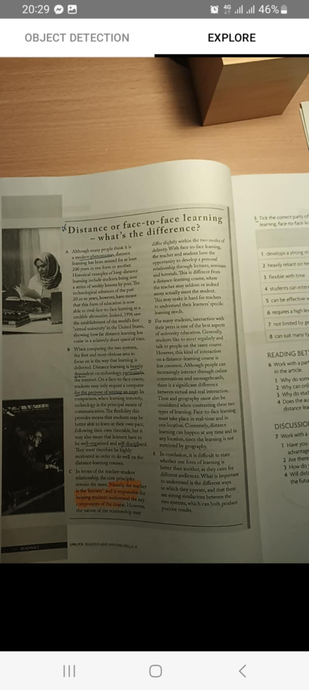
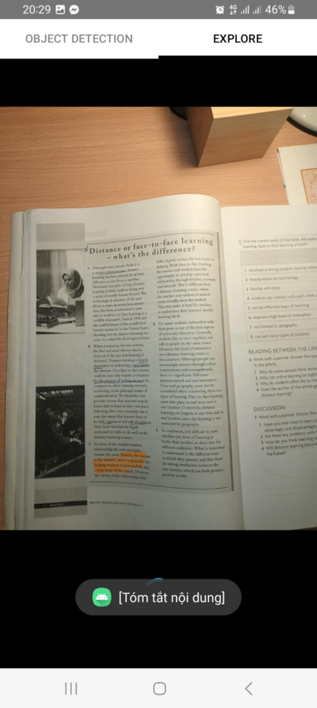

# A mobile app for disabled people

This project, developed in the course INT2041 - Human & Computer Interaction, aims to aid visually impaired people in interacting with their environment and enhancing social interaction.

## Table of contents
* Introduction
* Features
  * Exploring mode
    * Object Detection
    * Explore Surroundings
  * Socializing mode
    * Mood Tracking
    * Face Recognition
* Built with
* Contributors

## Introduction
Our team developed this project to enhance VIPs' proactivity in interactions. The app consists of two primary modes, each featuring different functionalities. 

The first mode, called **Explore Mode**, allows users to actively identify objects in their surroundings and gather detailed information, such as color and size, through PaliGemma. This mode includes 2 features: **Object Detection** and **Explore Surroundings**.

The second mode called **Socializing Mode**, focuses on enhancing social interactions and includes two features: **Mood Tracking** and **Face Recognition**.

Modes are navigated between each other by sliding vertically on the screen, while functions within the same mode are switched back and forth by sliding horizontally on the screen.

## Features
### Exploring mode
#### Object Detection
This is the default feature when starting the app. It allows users to identify objects in their surroundings in real-time by pointing the camera at the objects.
<table align="center">
  <tr>
    <td valign="top" style="text-align: center;"></td>
    <td valign="top" style="text-align: center;"> </td>
  </tr>
 </table>

#### Explore Surroundings
This feature allows users to explore their surroundings by taking a picture of the environment. The app will then analyze the image and provide a detailed description of user requests.
<table align="center">
  <tr>
    <td style="text-align: center;">1. Switch to Explore</td>
     <td style="text-align: center;">2. Take a picture of the surroundings by tapping twice on the screen</td>
     <td style="text-align: center;">3. Continue tapping twice on the screen to turn on recognizing speech</td>
  </tr>
  <tr>
    <td valign="top" style="text-align: center;"></td>
    <td valign="top" style="text-align: center;"></td>
    <td valign="top" style="text-align: center;"></td>
  </tr>
 </table>

<table align="center">
  <tr>
    <td style="text-align: center;">4. The system is processing the image with a request from user</td>
    <td style="text-align: center;">5. The system returns the results and reads them</td>
  </tr>
  <tr>
    <td valign="top" style="text-align: center;"></td>
    <td valign="top" style="text-align: center;"></td>
  </tr>
 </table>

### Socializing mode
#### Mood Tracking
Allows real-time recognition of the other person's emotions and returns sounds corresponding to each emotion.
<table align="center">
  <tr>
    <td style="text-align: center;"></td>
</tr>
</table>

#### Face Recognition
This feature allows real-time recognition of the faces of other people around them. The app will then return the name of the recognized person or none if their face is not in the database.
<table align="center">
  <tr>
    <td style="text-align: center;"></td>
</tr>
</table>

## Built with
* [Android Studio](https://developer.android.com/studio) - The IDE used for developing the app
* [Jetpack Compose](https://developer.android.com/jetpack/compose) - The UI toolkit used for building the app
* [Google Text-to-Speech](https://cloud.google.com/text-to-speech) - The API used for text-to-speech
* [Google Speech-to-Text](https://cloud.google.com/speech-to-text) - The API used for speech-to-text
* [MobileNets](https://huggingface.co/qualcomm/MobileNet-v2/blob/main/MobileNet-v2.tflite) - The model used for object detection
* [PaliGemma](https://paligemma.com/) - The API used for exploring surroundings by giving detailed descriptions
* [Google Face Detection](https://developers.google.com/ml-kit/vision/face-detection) - The API used for face detection and emotion tracking
* [MobileFaceNet](https://arxiv.org/abs/1804.07573) - The model used for face recognition with the face detected from Google MLKit Face Detection API

## Contributors
* Nguyễn Hữu Thế - 22028155
* Tăng Vĩnh Hà - 22028129
* Vũ Minh Thư - 22028116
* Chu Quang Cần - 22028093
* Lê Xuân Hùng - 22028172
